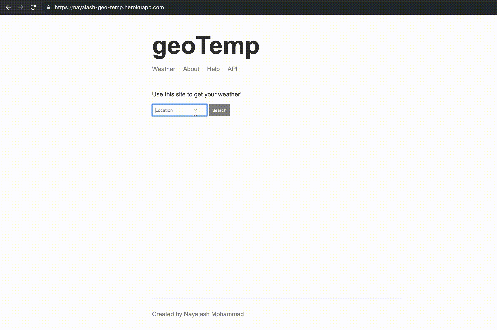

# geoTemp
A fullstack web application using Node.js, which can be used as an open API to fetch HTTP JSON or a client side user interface.



## Usage

This application can be used in two ways... As a client-side web app by using this [link](https://nayalash-geo-temp.herokuapp.com/). Or the server side OPEN API that returns HTTP JSON. 

When using the web app, you simply enter a location and it returns the weather for that provided location.

For using the API refer to the next section below.

## API USAGE

JSON RESPONSE that returns formatted address, forecast and inputted address.

### GET ENDPOINT

```
Example

URL: https://nayalash-geo-temp.herokuapp.com/dev?address=boston
```

You can customize the query key value pair "address" with whatever location you like.

JSON RESPONSE should look like this.

```
{
    "forecast": "Humid and partly cloudy throughout the day. It is currently 81.95 degress out. This high today is 90.48 with                  a low of 78.66. There is a 0% chance of rain.",
    "location": "Boston, Massachusetts, United States",
    "address": "boston"
}
```

Error Response should look like this

```
{
"error": "You must provide an address!"
}
```

### Running Application Online

Go to this [link](https://nayalash-geo-temp.herokuapp.com/).


### Running Application On Your Device

Clone the repository on to your machine.

Open the terminal at the entry point being the geoTemp-master folder.

Run Command Below

```
$ node src/app.js
```

View the project in your browser at

```
localhost:3000
```

## Deployment

The application was deployed on heroku.

[Heroku Website](https://www.heroku.com/)

## Dependencies

* [express](https://www.npmjs.com/package/express) - Web Framework
* [hbs](https://www.npmjs.com/package/hbs) - Templating Engine
* [request](https://www.npmjs.com/package/request) - HTTP Request package

## Acknowledgments

* Andrew Mead Udemy Course. 
[Link](https://mead.io/)

